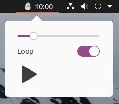

# Egg Timer for Gnome
[](https://travis-ci.com/gregorriegler/gnome-shell-extension-egg-timer)

I needed a very simple Egg Timer for Gnome.
The existing timer extensions did not work on Gnome 3.36.x so i had to write my own.



Tested on Ubuntu 20.04!

Does not work on Ubuntu 18.04 / Gnome 3.28.2!
I'd be happy about a pull request fixing that

- Icons made by Freepik <http://www.freepik.com/> from Flaticon <https://www.flaticon.com/>
- Sound from Mobtimer <https://github.com/zoeesilcock/mobtimer-react/blob/master/public/audio/music_box.wav>

## Install from the Gnome Extensions Page
You can install it in two clicks from this page https://extensions.gnome.org/extension/3423/egg-timer/.

## Install via npm
```
git clone git@github.com:gregorriegler/gnome-shell-extension-egg-timer.git
cd gnome-shell-extension-egg-timer
npm install
# Install Tested on Ubuntu 20.04
```

## Install via zip file
Just download the latest [egg-timer@gregorriegler.com.zip](https://github.com/gregorriegler/gnome-shell-extension-egg-timer/releases/download/v0.2-beta/egg-timer@gregorriegler.com.zip) from the [release](https://github.com/gregorriegler/gnome-shell-extension-egg-timer/releases/) page

and extract it to `~/.local/share/gnome-shell/extensions`

## Restart during development
```
npm run start
```

## Run tests
```
# once
npm test

# watch
npm run test:watch

# watch min
npm run test:watch:min
```


## Show log

```
journalctl -f -o cat /usr/bin/gnome-shell | grep 'egg-timer' -A7
```
